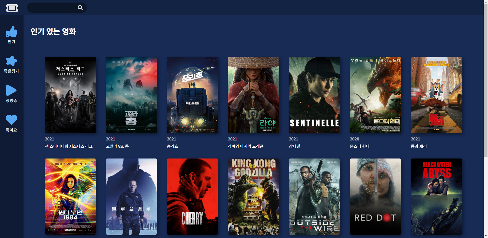
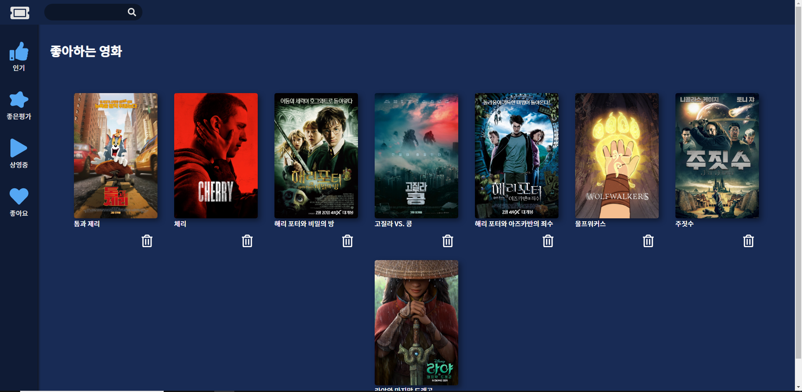
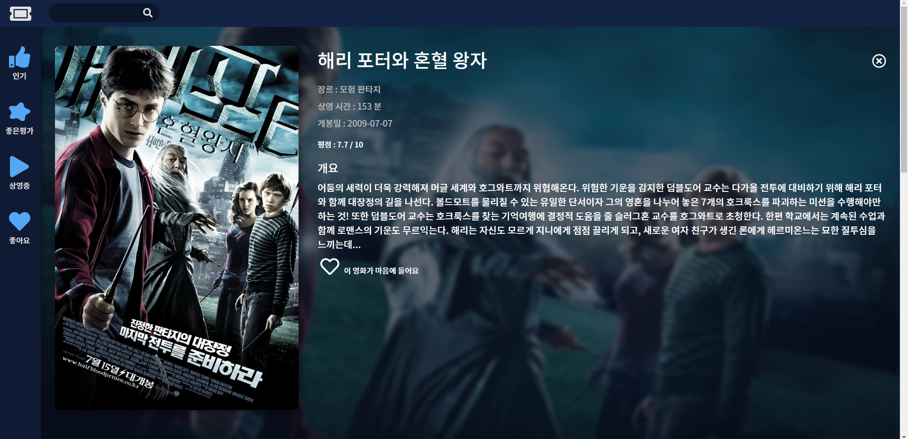

# 🎬Movie App

TMDB(The Movie DataBase) API 를 이용해서 만든 리액트 프로젝트로 사용자는 제목으로 영화를 검색하거나 정보를 찾는 기능을 제공합니다.

[사이트 바로가기](https://tlatjdgh3778.github.io/movie/)

## 스크린샷

|                                          |                                          |                                    |
| ---------------------------------------- | ---------------------------------------- | ---------------------------------- |
|    |    |  |
|  |  |                                    |

## 기술 스택

- JavaScript
- React
- TMDB API
